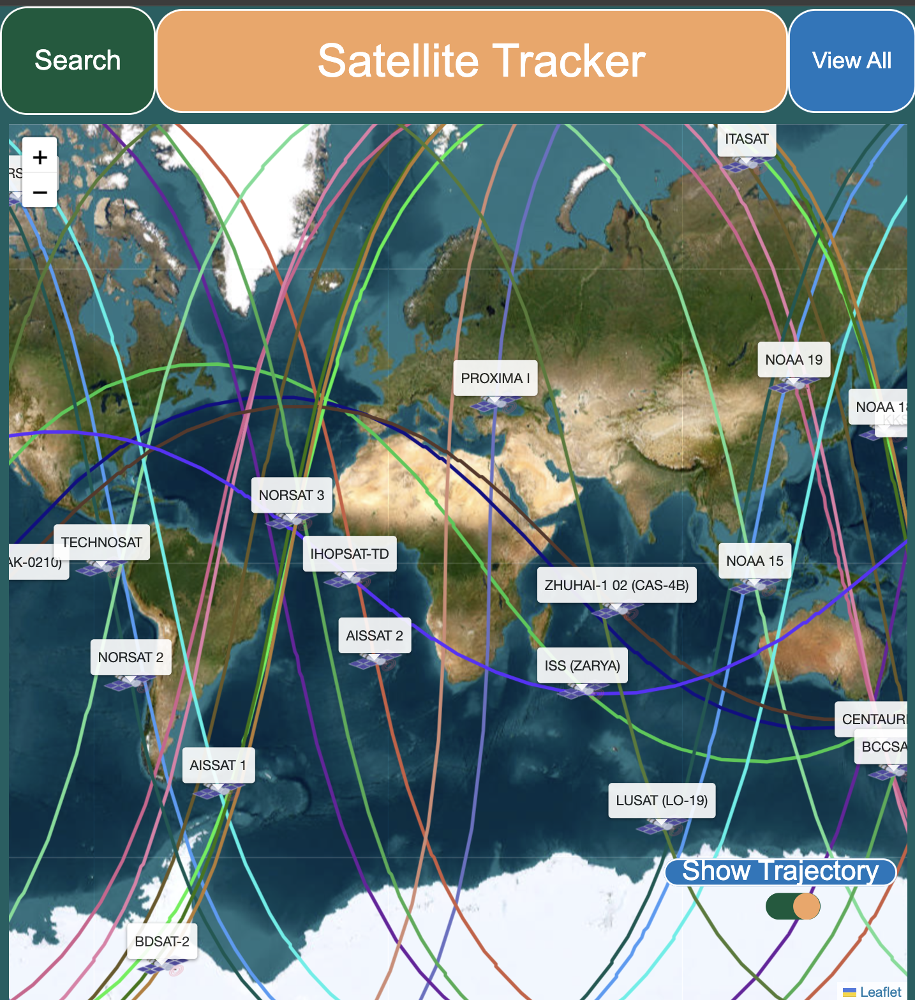

# Satellite tracker

This satellite tracker follows the movement of a specific list of satellites in a custom web interface. The TLE data is collected via APIs provided by [TLE API](https://tle.ivanstanojevic.me/) and transformed into geolocation coordinates (longitude/latitude). These are used to mark the satellites on a 2D earth map. Additional information are provided for each satellite, such as velocity (when the satellite's marker is hovered) and trajectory.

## Libraries used in this project

- `leaflet`       - used for map creation and manipulation
- `tle.js`        - used for satellites' TLE conversion and trajectory calculation

## Installation

1. Clone the repository
```bash
git clone https://https://github.com/Kryptoenix/satellite-tracker.git
cd satellite-tracker
```
2. Run the server using Python3
```bash
python3 -m http.server 7005
```
3. Open project in browser at `localhost:7005`

## Demo 



## What's next?

There are several things that can be improved in this project:
- reduce number of API requests when the satellite is changed from the `Search` button
- update the velocity when the satellite is changed from the `Search` button
- add a fast forward option to speed up the movement of the satellite on its trajectory
- anything you would like to see :) 
